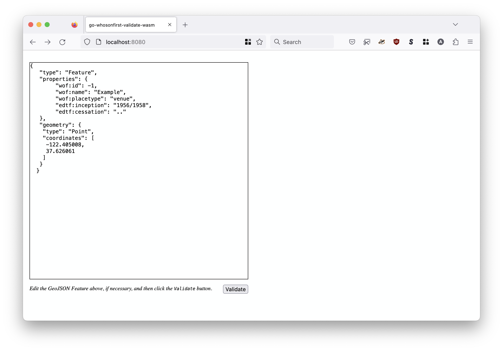
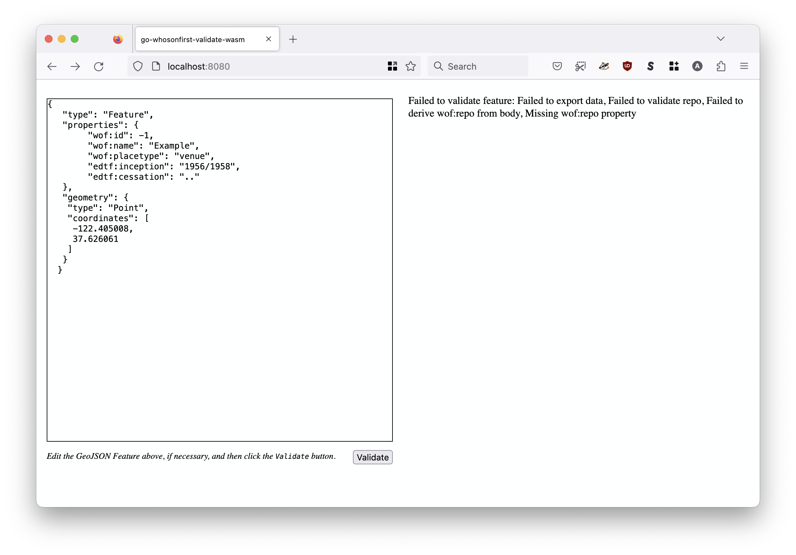
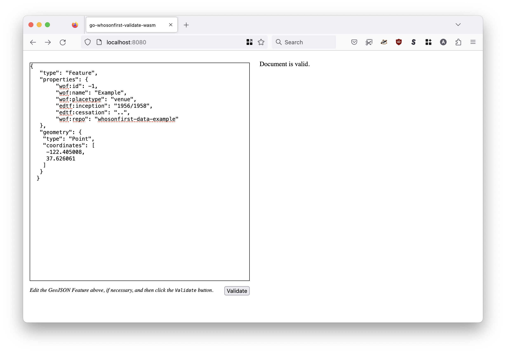

# go-whosonfirst-validate-wasm

Go package for compiling the `Validate` method of the go-whosonfirst-validate package to JavaScript-compatible and wasip1 WebAssembly (wasm) binaries. It also provides a net/http middleware packages for appending the necessary static assets and HTML resources to use the wasm binary in web applications.

## Important

This package has been deprecated and is no longer maintained. All the functionality has been moved in to the [whosonfirst/go-whosonfirst-validate](https://github.com/whosonfirst/go-whosonfirst-validate) package.

## Build

### wasmjs

To build the `validate_feature` WebAssembly binary for use in your JavaSceipt applications run the `wasm` Makefile target:

```
$> make wasm
GOOS=js GOARCH=wasm go build -mod vendor -ldflags="-s -w" \
		-o static/wasm/validate_feature.wasm \
		cmd/validate-feature-wasmjs/main.go
```

#### Use

To use the `validate_feature` WebAssembly binary in your applications a JSON-encoded GeoJSON string to the `validate_feature` function.

The function returns a JavaScript `Promise` that will return a JSON-encoded Who's On First (WOF) GeoJSON string on success or an error message if there was a problem.

```
	var str_f = '{"type": "Feature" ... }'	// A valid GeoJSON Feature
	
	validate_feature().then(rsp => {
	    console.log("WOF feature is valid.");
	}).catch(err => {
	    console.log("Failed to validate feature: ", err);
	});
```

In order to load the `validate_feature` function you will need to include the `wasm_exec.js` and `whosonfirst.validate.feature.js` JavaScript files, or functional equivalents. Both scripts are bundled with this package in the [static/javascript](static/javascript) folder.

#### Middleware

The `go-whosonfirst-validate-wasm/http` package provides methods for appending static assets and HTML resources to existing web applications to facilitate the use of the `validate_feature` WebAssembly binary. For example:

_Note the use of the `sfomuseum/go-http-wasm` package which is an HTTP middleware package for serving and appending resources to the `wasm_exec.js` JavaScript library._

```
package main

import (
	"embed"
	"flag"
	"fmt"
	"log"
	"net/http"

	validate_wasm "github.com/whosonfirst/go-whosonfirst-validate-wasm/http"
	"github.com/sfomuseum/go-http-wasm"	
)

//go:embed index.html example.*
var FS embed.FS

func main() {

	host := flag.String("host", "localhost", "The host name to listen for requests on")
	port := flag.Int("port", 8080, "The host port to listen for requests on")

	flag.Parse()

	mux := http.NewServeMux()

	wasm_opts := wasm.DefaultWASMOptions()
	
	wasm.AppendAssetHandlers(mux, wasm_opts)
	validate_wasm.AppendAssetHandlers(mux)

	http_fs := http.FS(FS)
	example_handler := http.FileServer(http_fs)

	example_handler = wasm.AppendResourcesHandler(example_handler, wasm_opts)

	mux.Handle("/", example_handler)

	addr := fmt.Sprintf("%s:%d", *host, *port)
	log.Printf("Listening for requests on %s\n", addr)

	http.ListenAndServe(addr, mux)
}
```

_Error handling omitted for brevity._

#### Example

There is a full working example of this application in the `cmd/example` folder. To run this application type the following command:

```
$> make example
go run -mod vendor cmd/example/main.go
2023/01/31 15:11:48 Listening for requests on localhost:8080
```

Then open `http://localhost:8080` in a  web browser. You should see something like this:



The default document included in the example is _invalid_ so when you click the "Validate" button you should see an error like this:



If you add a `"wof:repo":"whosonfirst-data-example"` property and resubmit the document the validation will succeed.



### wasip

To build the `validate_feature` WebAssembly WASI (wasip1) binary for use in your applications run the `wasi` Makefile target:

```
$> make wasi
GOOS=wasip1 GOARCH=wasm go build -mod vendor -ldflags="-s -w" \
		-o static/wasi/validate_feature.wasm \
		./cmd/validate-feature-wasip/main.go
```

#### Use

The `validate_feature.wasm` binary reads from STDIN and will report any errors found validating that input. For example:

```
$> cat fixtures/102527513.geojson | wasmer ./static/wasi/validate_feature.wasm

$> cat fixtures/102527513-bunk.geojson | wasmer ./static/wasi/validate_feature.wasm
2024/08/01 12:05:37 Failed to validate feature, Failed to validate ID, Failed to derive wof:id from body, Invalid wof:id '"102527513"'
```

## See also

* https://github.com/whosonfirst/go-whosonfirst-validate
* https://github.com/sfomuseum/go-http-wasm
* https://go.dev/blog/wasi
* https://github.com/golang/go/wiki/WebAssembly